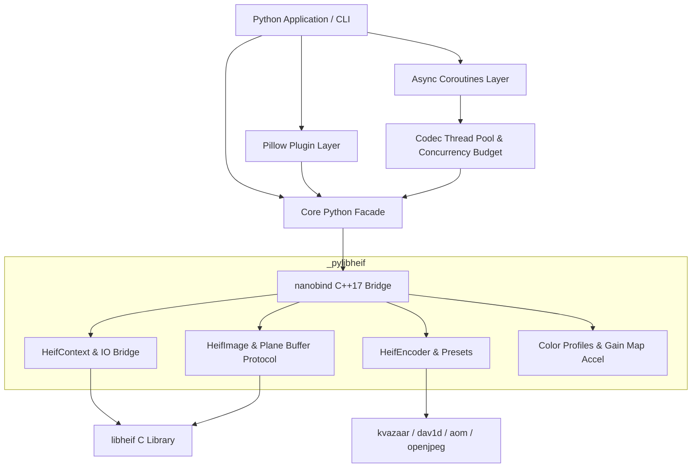

# pylibheif

<p align="center">
  <strong>High-performance Python bindings for libheif (HEIC / AVIF / JPEG2000) using nanobind</strong>
</p>

---

**`pylibheif`** provides high-performance, production-ready Python bindings for the [`libheif`](https://github.com/strukturag/libheif) codec library. It enables lightning-fast decoding, encoding, and metadata manipulation for HEIF/HEIC, AVIF, and JPEG2000 formats.

Built on C++17 and [`nanobind`](https://nanobind.readthedocs.io/), `pylibheif` achieves near-zero binding overhead, zero-copy buffer protocol interoperability with NumPy and Pillow, native asynchronous coroutines, and enterprise color management (ICC & ISO 21496-1 / Apple HDR Gain Maps).

---

## Key Features

- ⚡ **Near Zero-Copy & Native Buffer Protocol**: Direct memory export backed by RAII C++ capsules (`ctx.write_to_memoryview()`) and zero-overhead planar memory sharing with NumPy arrays.
- 🎨 **Deep Color & HDR Support**:
  - Full NCLX color primatives, transfer characteristics, and matrix coefficients parsing.
  - ICC profile extraction, validation, and synthesis (sRGB, Display P3, Adobe RGB, Rec.2020).
  - ISO 21496-1 and Apple Ultra HDR Gain Map decoding, metadata parsing, and tone-mapping reconstruction.
- 🖼️ **First-Class Pillow Integration**:
  - Transparent opener and saver plugin (`register_pillow_opener()`).
  - Seamless bidirectional array conversions (`to_pillow()` / `from_pillow()`).
  - Complete preservation of EXIF, XMP, ICC profiles, and orientation.
- 🌊 **High-Throughput Stream I/O**:
  - C++ `PyStreamReader` and `PyStreamWriter` bridging Python `io.BytesIO`, network streams, and file descriptors with read-ahead caching (>300k OPS).
- 🔄 **Native Async & Free-Threading Ready**:
  - First-class `AsyncHeifContext`, `AsyncHeifImageHandle`, and `AsyncHeifEncoder` running on optimized thread pools with automatic GIL release.
  - Full compatibility with Python 3.11 through 3.14 (including free-threaded builds).
- 🛠️ **Unified CLI (`heif` / `heic`)**:
  - Rich terminal inspection with shooting parameters/GPS rendering (`heif info`).
  - High-speed batch format conversion (`heif convert`).
  - Diagnostics and codec capabilities inspection (`heif doctor`).

---

## Architectural Highlights



---

## Quick Example

=== "Python Core"

    ```python
    import pylibheif

    # Read context and get primary image
    ctx = pylibheif.HeifContext()
    ctx.read_from_file("input.heic")
    handle = ctx.get_primary_image_handle()

    # Decode to RGB planar image
    image = handle.decode(
        pylibheif.HeifColorspace.RGB,
        pylibheif.HeifChroma.InterleavedRGB24
    )
    print(f"Decoded: {image.width}x{image.height}, format={image.chroma}")
    ```

=== "Pillow Integration"

    ```python
    from PIL import Image
    import pylibheif

    # Register transparent HEIF/AVIF opener
    pylibheif.register_pillow_opener()

    # Open and save just like any standard image format
    with Image.open("photo.heic") as img:
        print(img.size, img.mode, img.info.get("icc_profile"))
        img.save("output.avif", quality=85, preset="fast")
    ```

=== "CLI"

    ```bash
    # Inspect image metadata, color primaries, and shooting parameters
    heif info photo.heic --detail

    # Convert format with speed preset
    heif convert photo.heic photo.avif --preset fast --quality 80

    # Check supported codecs and platform capabilities
    heif doctor
    ```

---

## Practical Tutorials & Cookbooks

- 🚀 [FastAPI Cloud Streaming](tutorials/fastapi-streaming.md): Zero-disk, in-memory HEIC upload & AVIF transcoding microservice.
- 🌈 [HDR Gain Maps & ISO 21496-1](tutorials/hdr-gain-maps.md): Decoding, metadata extraction, and HDR reconstruction from iPhone & Ultra HDR photos.
- 🔍 [Depth Maps & Synthetic Bokeh](tutorials/depth-maps-auxiliary.md): Extracting portrait depth channels and applying depth-of-field blurs.
- ⚡ [High-Speed Batch Conversion](tutorials/batch-conversion.md): Async coroutine pipelines with Rich terminal progress bars.
- 🎞️ [Animated HEIF/AVIF Sequences](tutorials/animated-sequences.md): Creating variable frame rate animations.
